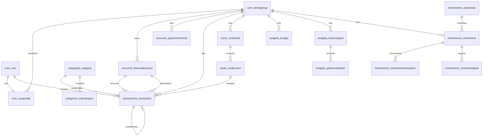

# Documentacao do Sistema FinanceFlow

Atualizado em: 2026-06-02  
Repositorio analisado: `financeiro-patina`  
Stack principal: Django 5.1, PostgreSQL, Redis, Celery, Channels, HTMX, Alpine.js, Chart.js e Tailwind via CDN.

## 1. Resumo executivo

O FinanceFlow e um sistema web de controle financeiro pessoal e familiar. A aplicacao organiza dados por grupos familiares, permitindo que usuarios cadastrem contas, transacoes, cartoes de credito, faturas, orcamentos, metas, categorias, relatorios e investimentos. O sistema tambem ja possui bases preparadas para notificacoes e assistente de IA, ainda sem interfaces completas implementadas.

O backend e um monolito Django modularizado por apps de dominio. A persistencia principal usa PostgreSQL, enquanto Redis e usado para cache, broker/result backend do Celery e camada de Channels. A aplicacao tem server-rendered templates Django, com interatividade pontual via HTMX e Alpine.js.

## 2. Objetivo do produto

O sistema resolve o acompanhamento financeiro de uma pessoa ou familia:

- Centraliza contas bancarias, carteiras digitais e contas de investimento.
- Registra receitas, despesas e transferencias.
- Calcula saldos atuais a partir de saldo inicial e transacoes pagas.
- Controla cartoes de credito, faturas, limite disponivel e parcelamentos.
- Compara gastos com orcamentos mensais.
- Acompanha metas financeiras e aportes.
- Gera relatorios de fluxo de caixa e despesas por categoria.
- Consolida uma carteira de investimentos com posicao, rentabilidade, dividendos e metas.
- Prepara automacoes para cotacoes e rendimentos por Celery.

## 3. Arquitetura geral

### 3.1 Estrutura de diretorios

```text
config/                Configuracao Django, ASGI, WSGI e Celery
apps/
  core/                Usuario, grupo familiar, perfil, auth customizado, dashboard
  accounts/            Contas financeiras e metodos de pagamento
  transactions/        Transacoes, tags e recorrencia
  cards/               Cartoes de credito e faturas
  categories/          Categorias e subcategorias
  budgets/             Orcamentos, metas financeiras e aportes
  reports/             Relatorios financeiros
  investments/         Carteira de investimentos, transacoes, metas e tasks
  ai_assistant/        Log de prompts/respostas de IA
  notifications/       Notificacoes de usuario
templates/             Templates Django por modulo
static/                CSS e JavaScript globais
requirements/          Dependencias por ambiente
```

### 3.2 Padrao de aplicacao

- Backend MVC/MVT Django classico, com `views.py`, `models.py`, `forms.py`, `urls.py` e templates.
- Controle de acesso por `@login_required` e decorator customizado `family_edit_required`.
- Multiusuario por `FamilyGroup`: a maioria dos dados financeiros pertence a um grupo familiar.
- Visualizacao pessoal/familiar em algumas telas via query string `?view=personal` ou `?view=family`.
- Soft delete para contas e cartoes via `is_active=False`; transacoes sao apagadas fisicamente.
- Calculos financeiros principais sao propriedades de models ou agregacoes em views.

## 4. Stack tecnica

### Backend

- Python 3.12+
- Django 5.1.4
- Django REST Framework instalado, mas sem APIs REST expostas no codigo atual.
- django-filter instalado, ainda sem uso expressivo nas views.
- django-htmx para deteccao de requisicoes HTMX.
- django-otp instalado para suporte a OTP/TOTP, mas sem fluxo de 2FA implementado nas telas analisadas.
- Channels + Daphne + channels-redis configurados; ASGI atual expoe apenas HTTP.

### Banco e infraestrutura

- PostgreSQL como banco relacional principal.
- Redis para:
  - Cache Django.
  - Broker do Celery.
  - Backend de resultados do Celery.
  - Channel layer do Channels.
- Celery + Celery Beat para automacoes periodicas.
- WhiteNoise para servir arquivos estaticos em producao.
- Docker Compose com servicos `web`, `db`, `redis`, `celery` e `celery-beat`.

### Frontend

- Templates Django server-side.
- TailwindCSS via CDN.
- HTMX para atualizacoes parciais em algumas telas de transacoes.
- Alpine.js para interacoes leves em formularios.
- Lucide Icons.
- Chart.js para graficos.
- CSS proprio em `static/css/finex-system.css` e `static/css/glass.css`.

## 5. Configuracao de ambiente

Variaveis esperadas pelo projeto, com base em `.env.example` e `config/settings/base.py`:

| Variavel | Uso |
| --- | --- |
| `DEBUG` | Liga/desliga modo debug. |
| `SECRET_KEY` | Chave secreta Django. |
| `DATABASE_URL` | URL PostgreSQL completa, com suporte a `sslmode`. |
| `DB_NAME` | Nome do banco quando `DATABASE_URL` nao e usada. |
| `DB_USER` | Usuario do banco. |
| `DB_PASSWORD` | Senha do banco. |
| `DB_HOST` | Host do banco. |
| `DB_PORT` | Porta do banco. |
| `DB_SSLMODE` | Modo SSL quando usando `DATABASE_URL`; default `require`. |
| `REDIS_URL` | URL Redis para cache, Celery e Channels. |
| `ALLOWED_HOSTS` | Hosts permitidos pelo Django. |
| `DJANGO_SETTINGS_MODULE` | Modulo de settings, normalmente `config.settings.development` ou `config.settings.production`. |

Observacao: o arquivo `.env` existe no repositorio local, mas esta documentacao nao inclui seus valores reais para evitar exposicao de credenciais.

## 6. Apps e responsabilidades

### 6.1 `apps.core`

Responsavel por usuario customizado, grupo familiar, perfil, convites, autenticacao e dashboard.

Principais recursos:

- Login por email usando `AUTH_USER_MODEL = 'core.User'`.
- Registro cria automaticamente:
  - Usuario.
  - Grupo familiar.
  - Perfil admin.
  - Metodos de pagamento padrao: PIX, Dinheiro, Debito e Cartao de Credito.
- Middleware `EnsureUserProfileMiddleware` garante que usuarios autenticados tenham perfil e grupo familiar.
- Perfil financeiro com moeda, fuso horario, renda mensal e preferencias de notificacao.
- Convites familiares com token UUID e expiracao de 48 horas.
- Dashboard com saldo total, receitas, despesas, economia mensal, grafico de seis meses, gastos por categoria e transacoes recentes.

### 6.2 `apps.accounts`

Responsavel por contas financeiras e metodos de pagamento.

Principais recursos:

- CRUD de contas financeiras.
- Tipos de conta: corrente, poupanca, carteira/especie, digital, investimento e salario.
- Bancos predefinidos: Nubank, Itau, Bradesco, Banco do Brasil, Caixa, Inter, XP, BTG, C6, PicPay e Outro.
- Titularidade pessoal ou compartilhada.
- Inclusao/opcao de exclusao no saldo total.
- Calculo de saldo atual por conta:
  - `saldo inicial + receitas pagas - despesas pagas + transferencias recebidas - transferencias enviadas`.
- Transferencia entre contas registrada como `Transaction` do tipo `transfer`.
- Remocao logica de contas via `is_active=False`.

### 6.3 `apps.transactions`

Responsavel por lancamentos financeiros.

Principais recursos:

- Tipos: receita, despesa e transferencia.
- Status: pago/recebido, pendente e agendado.
- Vinculos opcionais com conta, conta destino, cartao, fatura, categoria, subcategoria, metodo de pagamento, tags, comprovante e regra de recorrencia.
- Suporte estrutural a parcelamento por campos `parent_transaction`, `installment_number` e `installment_total`.
- Filtros de listagem:
  - Tipo.
  - Periodo: mes atual, mes anterior, ano atual.
  - Categoria.
  - Busca por descricao, observacoes ou estabelecimento.
- HTMX para criar, apagar e alternar status em linhas parciais.
- Validacao no form:
  - Receita nao pode usar cartao de credito como metodo.
  - Metodo de pagamento do tipo credito exige cartao.
  - Subcategoria precisa pertencer a categoria selecionada.

### 6.4 `apps.cards`

Responsavel por cartoes de credito, faturas e lancamentos no credito.

Principais recursos:

- Cadastro de cartoes com bandeira, ultimos quatro digitos, titular, limite, fechamento, vencimento, conta de debito, cores, cashback e anuidade.
- Geracao automatica de faturas futuras ao criar cartao.
- Descoberta da fatura correta a partir da data de compra e dia de fechamento.
- Calculo de limite disponivel:
  - `limite - total da fatura aberta`.
- Percentual de utilizacao do limite.
- Listagem da fatura atual e proxima fatura.
- Detalhe do cartao com historico de ate 12 faturas.
- Pagamento de fatura:
  - Cria transacao financeira do tipo `transfer`.
  - Atualiza `paid_amount`.
  - Marca fatura como `paid` ou `partial`.
- Parcelamento:
  - Primeira parcela fica na transacao original.
  - Parcelas futuras sao criadas como transacoes `scheduled`.
  - Cada parcela e associada a fatura correspondente.

### 6.5 `apps.categories`

Responsavel por categorias e subcategorias.

Principais recursos:

- Categorias de receita e despesa.
- Categorias globais de sistema (`is_system=True`) e categorias especificas de familia.
- Subcategorias vinculadas a uma categoria.
- Comando `seed_categories` popula categorias padrao.
- Rota `ensure-transfer/` cria/garante categoria de transferencia.

Categorias padrao de despesa incluem moradia, alimentacao, transporte, saude, educacao, lazer, vestuario, assinaturas, pets, impostos/taxas, pessoal, transferencia e outros.

Categorias padrao de receita incluem salario, freelance, investimentos, aluguel recebido, presente/doacao, reembolso e outros.

### 6.6 `apps.budgets`

Responsavel por orcamentos e metas financeiras.

Principais recursos:

- Orcamentos por categoria, mes de referencia, periodicidade, escopo pessoal/familiar, limite e alerta percentual.
- Calculo de valor gasto a partir de transacoes pagas, de despesa, nao ignoradas, na mesma categoria e mes.
- Indicadores:
  - Percentual usado.
  - Valor restante.
  - Estouro de orcamento.
  - Cor de status: verde, amarelo ou vermelho.
- Clonagem de orcamentos do mes anterior para o mes atual.
- Metas financeiras com valor alvo, valor atual, data alvo, conta vinculada, contribuicao mensal planejada, icone, cor e conclusao.
- Calculo de percentual completo, meses restantes, aporte mensal sugerido e status `on_track`.
- Registro de aporte em meta:
  - Pode gerar transacao vinculada.
  - Pode registrar transferencia para conta vinculada.
  - Marca meta como concluida quando atinge o alvo.

### 6.7 `apps.reports`

Responsavel por relatorios financeiros.

Principais recursos:

- Relatorio anual/mensal com base em transacoes pagas e nao ignoradas.
- Suporte a visao pessoal ou familiar.
- Fluxo dos ultimos 12 meses:
  - Receita.
  - Despesa.
  - Saldo mensal.
- Top 10 categorias de despesa no ano.
- Receitas, despesas e economia acumuladas no ano.
- Distribuicao de despesas do mes atual por categoria.

### 6.8 `apps.investments`

Responsavel por carteira de investimentos.

Principais recursos:

- Classes de ativo de sistema: acoes, FIIs, renda fixa pre, renda fixa pos, Tesouro Direto, criptomoedas, previdencia, poupanca, ETF, BDR e outro.
- Cadastro de investimento com:
  - Classe.
  - Nome.
  - Ticker/codigo.
  - Instituicao.
  - Quantidade.
  - Preco medio.
  - Preco atual.
  - Tipo/taxa de remuneracao.
  - Vencimento.
  - Valor aplicado.
  - Valores consolidados em cache.
- Dashboard de portfolio:
  - Total investido.
  - Valor atual.
  - Lucro/prejuizo.
  - Rentabilidade percentual.
  - Dividendos.
  - Alocacao por classe.
  - Top gainers e top losers.
  - Metas de investimento.
- Listagem com filtro por classe de ativo e visao pessoal/familiar.
- Detalhe de investimento com transacoes e proventos.
- Transacoes de investimento:
  - Compra.
  - Venda.
  - Dividendo.
  - JCP.
  - Rendimento.
  - Split.
  - Grupamento.
- Recalculo automatico do investimento ao salvar uma transacao de investimento.
- Metas de investimento por classe ou ativo especifico.
- Atualizacao manual de cotacoes via Celery.

### 6.9 `apps.ai_assistant`

Base inicial para assistente de IA.

Modelo existente:

- Usuario.
- Prompt.
- Resposta.
- Data de criacao.

Nao ha views, urls ou interface de chat implementadas no codigo analisado.

### 6.10 `apps.notifications`

Base inicial para notificacoes.

Modelo existente:

- Usuario.
- Titulo.
- Mensagem.
- Flag `is_read`.
- Data de criacao.

Nao ha views, urls, tasks ou interface completa de notificacoes implementadas no codigo analisado.

## 7. Rotas do sistema

### 7.1 Rotas globais

| Caminho | Modulo | Descricao |
| --- | --- | --- |
| `/admin/` | Django Admin | Administracao. |
| `/` | core | Dashboard. |
| `/auth/` | django.contrib.auth.urls | Rotas padrao de auth Django. |
| `/accounts/` | accounts | Contas financeiras. |
| `/transactions/` | transactions | Transacoes. |
| `/cards/` | cards | Cartoes e faturas. |
| `/categories/` | categories | Categorias. |
| `/budgets/` | budgets | Orcamentos e metas financeiras. |
| `/reports/` | reports | Relatorios. |
| `/investments/` | investments | Carteira de investimentos. |

### 7.2 `core`

| Rota | View | Descricao |
| --- | --- | --- |
| `/` | `dashboard` | Dashboard financeiro. |
| `/auth/register/` | `register` | Cadastro de usuario. |
| `/auth/login/` | `login_view` | Login customizado por email. |
| `/auth/logout/` | `logout_view` | Logout. |
| `/profile/` | `profile` | Perfil e preferencias. |
| `/family/` | `family_settings` | Grupo familiar, membros e convites. |
| `/family/invite/` | `invite_member` | Envio de convite. |
| `/family/accept/<uuid:token>/` | `accept_invite` | Aceite de convite. |

### 7.3 `accounts`

| Rota | View | Descricao |
| --- | --- | --- |
| `/accounts/` | `account_list` | Lista contas e saldo total. |
| `/accounts/create/` | `account_create` | Cria conta. |
| `/accounts/<id>/` | `account_detail` | Detalhe e ultimas transacoes. |
| `/accounts/<id>/edit/` | `account_edit` | Edita conta. |
| `/accounts/<id>/delete/` | `account_delete` | Desativa conta. |
| `/accounts/transfer/` | `transfer` | Transfere entre contas. |

### 7.4 `transactions`

| Rota | View | Descricao |
| --- | --- | --- |
| `/transactions/` | `transaction_list` | Lista e filtra transacoes. |
| `/transactions/create/` | `transaction_create` | Cria transacao. |
| `/transactions/<id>/edit/` | `transaction_edit` | Edita transacao. |
| `/transactions/<id>/delete/` | `transaction_delete` | Exclui transacao. |
| `/transactions/<id>/toggle-status/` | `toggle_status` | Alterna pago/pendente. |

### 7.5 `cards`

| Rota | View | Descricao |
| --- | --- | --- |
| `/cards/` | `card_list` | Lista cartoes. |
| `/cards/create/` | `card_create` | Cria cartao e faturas futuras. |
| `/cards/<id>/` | `card_detail` | Detalhe, faturas e lancamentos. |
| `/cards/<id>/pay/` | `pay_invoice` | Paga fatura. |
| `/cards/<card_id>/add-transaction/` | `add_card_transaction` | Adiciona gasto no cartao. |

### 7.6 `budgets`

| Rota | View | Descricao |
| --- | --- | --- |
| `/budgets/` | `budget_list` | Lista orcamentos e metas. |
| `/budgets/create/` | `budget_create` | Cria orcamento. |
| `/budgets/clone/` | `budget_clone` | Copia orcamentos do mes anterior. |
| `/budgets/goals/create/` | `goal_create` | Cria meta financeira. |
| `/budgets/goals/<id>/contribute/` | `goal_contribute` | Registra aporte em meta. |

### 7.7 `investments`

| Rota | View | Descricao |
| --- | --- | --- |
| `/investments/` | `portfolio_dashboard` | Dashboard de portfolio. |
| `/investments/list/` | `investment_list` | Lista investimentos. |
| `/investments/create/` | `investment_create` | Cria investimento. |
| `/investments/<id>/` | `investment_detail` | Detalhe do investimento. |
| `/investments/<id>/add-transaction/` | `investment_add_transaction` | Registra transacao do investimento. |
| `/investments/goals/create/` | `investment_goal_create` | Cria meta de investimento. |
| `/investments/refresh/` | `refresh_prices` | Dispara atualizacao de cotacoes. |

## 8. Banco de dados

### 8.1 Configuracao

O banco padrao e PostgreSQL. O projeto aceita duas formas de configuracao:

1. Variaveis separadas: `DB_NAME`, `DB_USER`, `DB_PASSWORD`, `DB_HOST`, `DB_PORT`.
2. `DATABASE_URL`, com parsing manual em `config/settings/base.py` e suporte a `sslmode`.

No Docker Compose, o banco local usa:

- Imagem: `postgres:16-alpine`.
- Database: `financeflow`.
- Usuario: `financeflow`.
- Porta interna: `5432`.
- Volume: `postgres_data`.

### 8.2 Tabelas de dominio

Os nomes abaixo seguem a convencao padrao do Django: `<app_label>_<modelname>`.

#### `core_user`

Usuario customizado baseado em `AbstractUser`.

Campos principais:

- `email` unico; campo de login.
- `username`, `first_name`, `last_name`, senha e campos padrao do Django.
- Permissoes e flags padrao: `is_active`, `is_staff`, `is_superuser`.

Relacionamentos:

- 1:1 com `core_userprofile`.
- 1:N com transacoes, contas, cartoes, investimentos, metas, notificacoes e logs de IA.

Tabelas auxiliares herdadas:

- `core_user_groups`.
- `core_user_user_permissions`.

#### `core_familygroup`

Representa a familia/grupo financeiro.

Campos:

- `name`.
- `invite_code` UUID unico.
- `created_at`.

Relacionamentos:

- 1:N com perfis, convites, contas, metodos de pagamento, transacoes, cartoes, orcamentos, metas, investimentos e tags.

#### `core_userprofile`

Perfil financeiro e permissao do usuario dentro do grupo familiar.

Campos:

- `user` OneToOne.
- `family_group` FK opcional.
- `role`: `admin`, `member`, `viewer`.
- `avatar`.
- `default_currency`: `BRL`, `USD`, `EUR`.
- `timezone`.
- `financial_month_start_day`.
- `monthly_income`.
- Flags de notificacao: budget, fatura e saldo baixo.
- Limiares: saldo baixo, percentual de orcamento e dias antes do vencimento.

Regras:

- `is_admin` quando `role == admin`.
- `can_edit` quando `role` e `admin` ou `member`.

#### `core_familyinvitation`

Convite para entrada em grupo familiar.

Campos:

- `family_group`.
- `email`.
- `token` UUID unico.
- `invited_by`.
- `accepted`.
- `created_at`.
- `expires_at`.

Regras:

- Expira em 48 horas por padrao.
- `is_expired` compara `timezone.now()` com `expires_at`.

#### `accounts_financialaccount`

Conta financeira.

Campos:

- `owner`.
- `family_group`.
- `ownership`: `personal`, `shared`.
- `name`.
- `account_type`.
- `bank`, `bank_custom`.
- `initial_balance`.
- `color`, `icon`.
- `is_active`.
- `include_in_total`.
- `created_at`.

Regras:

- `current_balance` e calculado dinamicamente a partir das transacoes pagas.
- Contas removidas sao apenas desativadas.

#### `accounts_paymentmethod`

Metodo de pagamento.

Campos:

- `family_group`.
- `name`.
- `method_type`: `pix`, `ted`, `boleto`, `debit`, `cash`, `credit`, `other`.
- `is_default`.
- `is_active`.

Regra:

- Ao salvar um metodo como padrao, outros metodos padrao da mesma familia sao desmarcados.

#### `transactions_tag`

Tag personalizada de transacao.

Campos:

- `family_group`.
- `name`.
- `color`.

#### `transactions_recurrencerule`

Estrutura para recorrencia.

Campos:

- `frequency`: diaria, semanal, quinzenal, mensal, trimestral, anual.
- `interval`.
- `end_date`.
- `max_occurrences`.
- `occurrences_created`.

Observacao: o modelo existe, mas nao ha rotina completa de geracao de recorrencias no codigo analisado.

#### `transactions_transaction`

Lancamento financeiro.

Campos principais:

- `user`.
- `family_group`.
- `account`.
- `destination_account`.
- `credit_card`.
- `invoice`.
- `category`.
- `subcategory`.
- `payment_method`.
- `parent_transaction`.
- `installment_number`.
- `installment_total`.
- `recurrence_rule`.
- `description`.
- `amount`.
- `transaction_type`: `income`, `expense`, `transfer`.
- `date`.
- `due_date`.
- `status`: `paid`, `pending`, `scheduled`.
- `notes`.
- `receipt_image`.
- `location`.
- `is_ignored`.
- `created_at`, `updated_at`.

Relacionamentos:

- M:N com `transactions_tag` pela tabela `transactions_transaction_tags`.
- Pode estar vinculada a uma fatura de cartao.
- Pode representar transferencia entre contas.

Indices:

- `family_group`, `date`.
- `user`, `transaction_type`.

#### `categories_category`

Categoria financeira.

Campos:

- `family_group` opcional.
- `name`.
- `category_type`: `income`, `expense`.
- `icon`.
- `color`.
- `is_system`.
- `sort_order`.

Observacao:

- Categorias de sistema tem `family_group = null`.
- Categorias familiares pertencem a um grupo especifico.

#### `categories_subcategory`

Subcategoria.

Campos:

- `category`.
- `name`.
- `icon`.

#### `cards_creditcard`

Cartao de credito.

Campos:

- `owner`.
- `family_group`.
- `ownership`.
- `name`.
- `brand`.
- `last_four_digits`.
- `holder_name`.
- `credit_limit`.
- `closing_day`.
- `due_day`.
- `debit_account`.
- `color_from`, `color_to`.
- `cashback_percentage`.
- `annual_fee`.
- `is_active`.

Propriedades:

- `current_invoice`.
- `available_limit`.
- `utilization_percentage`.

#### `cards_cardinvoice`

Fatura de cartao.

Campos:

- `card`.
- `reference_month`.
- `closing_date`.
- `due_date`.
- `total_amount`.
- `paid_amount`.
- `status`: `future`, `open`, `closed`, `paid`, `partial`, `overdue`.
- `payment_date`.
- `payment_transaction`.

Restricoes:

- `unique_together = ['card', 'reference_month']`.

Propriedades:

- `days_until_due`.
- `minimum_payment`: maior valor entre 15% da fatura e R$ 50.

#### `budgets_budget`

Orcamento.

Campos:

- `family_group`.
- `owner`.
- `category`.
- `amount`.
- `period`: `monthly`, `yearly`.
- `scope`: `personal`, `family`.
- `reference_month`.
- `rollover`.
- `alert_threshold`.
- Campos legados: `name`, `month`.

Restricoes:

- `unique_together = ['owner', 'category', 'reference_month', 'scope']`.

Propriedades:

- `spent_amount`.
- `percentage_used`.
- `remaining`.
- `is_over_budget`.
- `status_color`.

#### `budgets_financialgoal`

Meta financeira.

Campos:

- `family_group`.
- `owner`.
- `name`.
- `goal_type`: reserva, quitar divida, compra planejada, emergencia, investimento, viagem.
- `scope`.
- `target_amount`.
- `current_amount`.
- `target_date`.
- `linked_account`.
- `monthly_contribution`.
- `color`, `icon`.
- `is_completed`.
- `created_at`.

Propriedades:

- `percentage_complete`.
- `months_remaining`.
- `suggested_monthly`.
- `on_track`.

#### `budgets_goalcontribution`

Aporte em meta financeira.

Campos:

- `goal`.
- `amount`.
- `date`.
- `notes`.
- `transaction` OneToOne opcional.

#### `investments_assetclass`

Classe de ativo.

Campos:

- `name`.
- `asset_type` unico.
- `color`.
- `icon`.
- `liquidity_days`.
- `is_taxable`.
- `ir_rate`.
- `is_system`.

#### `investments_investment`

Posicao de investimento.

Campos:

- `owner`.
- `family_group`.
- `asset_class`.
- `ownership`.
- `name`.
- `ticker`.
- `institution`.
- `quantity`.
- `average_price`.
- `current_price`.
- `last_price_update`.
- `rate_type`.
- `rate_value`.
- `maturity_date`.
- `invested_amount`.
- Campos cacheados: `current_value`, `total_invested`, `total_earnings`, `total_dividends`, `daily_change`, `daily_change_pct`.
- `is_active`.
- `notes`.
- `created_at`.

Propriedades:

- `profit_loss`.
- `profit_loss_pct`.
- `is_fixed_income`.
- `is_variable_income`.
- `is_crypto`.

Metodos:

- `initialize_snapshot()`.
- `recalculate()`.

#### `investments_investmenttransaction`

Movimentacao de investimento.

Campos:

- `investment`.
- `transaction_type`: compra, venda, dividendo, JCP, rendimento, split, grupamento.
- `date`.
- `quantity`.
- `price`.
- `amount`.
- `fees`.
- `ir_withheld`.
- `broker`.
- `notes`.
- `financial_transaction`.

Regra:

- Se `amount` nao vier preenchido e houver quantidade/preco, o valor e calculado.
- Depois de salvar, chama `investment.recalculate()`.

#### `investments_investmentgoal`

Meta de investimento.

Campos:

- `family_group`.
- `owner`.
- `name`.
- `asset_class`.
- `investment`.
- `target_amount`.
- `target_date`.
- `monthly_contribution`.
- `color`.
- `is_completed`.
- `created_at`.

Propriedades:

- `current_amount`, calculado por investimento especifico ou soma da classe.
- `percentage_complete`.

#### `ai_assistant_aiassistantlog`

Log de interacao de IA.

Campos:

- `user`.
- `prompt`.
- `response`.
- `created_at`.

#### `notifications_notification`

Notificacao simples.

Campos:

- `user`.
- `title`.
- `message`.
- `is_read`.
- `created_at`.

### 8.3 Tabelas de infraestrutura

Alem das tabelas de dominio, o projeto usa tabelas padrao de:

- Django auth/permissions/groups.
- Django sessions.
- Django admin log.
- Django contenttypes.
- Celery Beat (`django_celery_beat_*`).
- Django OTP/TOTP, se migrations do pacote forem aplicadas.

## 9. Relacionamentos principais



## 10. Dados mestres e seeds

### 10.1 Categorias

Comando:

```powershell
python manage.py seed_categories
```

Popula categorias e subcategorias de sistema para receitas e despesas. As categorias criadas tem `family_group=None` e `is_system=True`.

### 10.2 Classes de ativos

Comando:

```powershell
python manage.py seed_asset_classes
```

Popula classes de ativos:

- Acoes.
- FIIs.
- CDB/LCI/LCA.
- Tesouro Direto.
- Renda Fixa Pre.
- Criptomoedas.
- ETF.
- BDR.
- Previdencia Privada.
- Poupanca.
- Outro.

## 11. Automacoes e integracoes externas

### 11.1 Celery

Configuracao:

- App Celery: `config/celery.py`.
- Broker: `REDIS_URL`.
- Result backend: `REDIS_URL`.
- Scheduler: `django_celery_beat.schedulers:DatabaseScheduler`.
- Timezone: `America/Sao_Paulo`.

### 11.2 Tasks de investimentos

#### `update_stock_prices`

- Atualiza acoes, FIIs, ETFs e BDRs.
- Consulta `brapi.dev`.
- Agrupa tickers em lotes de ate 10.
- Atualiza preco atual, variacao diaria, percentual diario, data de atualizacao e valor atual.
- Usa token `demo` no codigo atual.

#### `update_crypto_prices`

- Atualiza criptomoedas.
- Consulta CoinGecko.
- Mapeia tickers conhecidos como BTC, ETH, BNB, SOL etc.
- Atualiza preco em BRL, variacao percentual 24h e valor atual.

#### `update_fixed_income_returns`

- Consulta CDI diario no Banco Central, serie SGS 12.
- Calcula rendimento para renda fixa pos-fixada tipo CDI e pre-fixada.
- Cria transacao de investimento do tipo `income`.
- Atualiza `total_earnings` e `current_value`.

#### `setup_investment_schedules`

Cria tarefas periodicas no Celery Beat:

| Tarefa | Frequencia |
| --- | --- |
| Atualizar cotacoes B3 | A cada 15 min em dias uteis, 9h-18h. |
| Atualizar cotacoes cripto | A cada 5 min. |
| Calcular rendimentos renda fixa | Dias uteis as 18:30. |

## 12. Regras de permissao e seguranca

### 12.1 Autenticacao

- Usuario customizado com login por email.
- Rotas sensiveis usam `@login_required`.
- Django auth padrao tambem esta incluido em `/auth/`.

### 12.2 Autorizacao funcional

Papeis no perfil:

- `admin`: pode editar.
- `member`: pode editar.
- `viewer`: apenas visualizacao.

O decorator `family_edit_required` bloqueia alteracoes para perfis sem `can_edit`.

### 12.3 Isolamento por familia

As views filtram objetos pelo `family_group` do usuario autenticado. Isso evita acesso casual a dados de outras familias nas telas analisadas.

### 12.4 Pontos de atencao

- Nao ha permissoes granulares por objeto alem do filtro por grupo familiar e papel.
- Nao ha API REST exposta, apesar do DRF estar instalado.
- django-otp esta instalado, mas nao ha fluxo completo de 2FA nas views/templates analisados.
- Convites sao aceitos por token, exigindo usuario autenticado.
- Algumas mensagens/textos aparecem com encoding inconsistente no terminal, indicando possivel necessidade de padronizar UTF-8 nos arquivos ou no ambiente.

## 13. Fluxos principais

### 13.1 Onboarding

1. Usuario acessa `/auth/register/`.
2. Sistema cria usuario com `username=email`.
3. Sistema cria `FamilyGroup`.
4. Sistema cria `UserProfile` com papel `admin`.
5. Sistema cria metodos de pagamento padrao.
6. Usuario e autenticado e redirecionado ao dashboard.

### 13.2 Lancamento comum

1. Usuario acessa `/transactions/create/`.
2. Seleciona tipo, valor, data, categoria e, quando aplicavel, conta/metodo/cartao.
3. Form valida consistencia de metodo, cartao e categoria.
4. Transacao e salva no grupo familiar.
5. Saldos e relatorios passam a refletir a transacao se `status='paid'`.

### 13.3 Transferencia entre contas

1. Usuario acessa `/accounts/transfer/`.
2. Seleciona conta origem, destino, valor e data.
3. Sistema cria `Transaction` tipo `transfer`.
4. `current_balance` da origem subtrai a transferencia.
5. `current_balance` do destino soma a transferencia.

### 13.4 Compra no cartao

1. Usuario acessa detalhe do cartao.
2. Lanca despesa no cartao.
3. Sistema escolhe fatura conforme data da compra e dia de fechamento.
4. Transacao e associada a `CreditCard` e `CardInvoice`.
5. Total da fatura e recalculado.
6. Se houver parcelas, sistema cria transacoes futuras agendadas.

### 13.5 Pagamento de fatura

1. Usuario acessa `/cards/<id>/pay/`.
2. Informa valor, conta e data.
3. Sistema cria transacao tipo `transfer`.
4. Fatura recebe `paid_amount`, `payment_transaction`, `payment_date`.
5. Status vira `paid` ou `partial`.

### 13.6 Meta financeira

1. Usuario cria uma meta em `/budgets/goals/create/`.
2. Pode vincular uma conta e contribuicao mensal planejada.
3. Ao aportar, sistema cria `GoalContribution`.
4. Opcionalmente cria transacao financeira.
5. Se valor atual atinge valor alvo, meta e concluida.

### 13.7 Atualizacao de carteira

1. Usuario cria investimento.
2. Snapshot inicial calcula posicao e valor atual.
3. Ao registrar compra/venda/provento, `InvestmentTransaction.save()` recalcula a posicao.
4. Atualizacao manual de cotacoes dispara tasks Celery.

## 14. Admin Django

Modelos registrados no admin:

- `core`: User, FamilyGroup, UserProfile, FamilyInvitation.
- `accounts`: FinancialAccount, PaymentMethod.
- `transactions`: Transaction, Tag, RecurrenceRule.
- `cards`: CreditCard, CardInvoice.
- `categories`: Category, Subcategory.
- `investments`: AssetClass, Investment, InvestmentTransaction, InvestmentGoal.

Nao foram encontrados registros customizados de admin para budgets, notificacoes ou assistente de IA nos arquivos analisados.

## 15. Instalacao e execucao local

### 15.1 Ambiente Python

```powershell
python -m venv .venv
.\.venv\Scripts\Activate.ps1
pip install -r requirements\development.txt
```

### 15.2 Configuracao

Criar `.env` baseado em `.env.example` e preencher credenciais de banco/Redis.

### 15.3 Banco e seeds

```powershell
python manage.py migrate
python manage.py seed_categories
python manage.py seed_asset_classes
python manage.py createsuperuser
```

### 15.4 Servidor web

```powershell
python manage.py runserver
```

URL padrao:

```text
http://localhost:8000/
```

### 15.5 Celery

```powershell
celery -A config worker -l info
celery -A config beat -l info --scheduler django_celery_beat.schedulers:DatabaseScheduler
```

### 15.6 Docker Compose

```powershell
docker compose up --build
```

Servicos:

- `web`: Django dev server.
- `db`: PostgreSQL 16.
- `redis`: Redis 7.
- `celery`: worker.
- `celery-beat`: scheduler.

## 16. Testes e qualidade

Dependencias de teste existem em `requirements/development.txt`:

- `pytest`.
- `pytest-django`.
- `factory-boy`.

Porem nao foram encontrados arquivos de teste do projeto fora de `.venv`.

Recomendacoes:

- Criar testes unitarios para calculo de saldos, faturas, parcelamentos, orcamentos e investimentos.
- Criar testes de autorizacao por grupo familiar.
- Criar testes de formularios para validacoes criticas.
- Criar testes de tasks com mocks de APIs externas.
- Adicionar CI com `python manage.py check`, `pytest` e validacao de migrations.

## 17. Lacunas e riscos tecnicos

### 17.1 Funcionalidades parcialmente preparadas

- Assistente IA possui apenas modelo de log.
- Notificacoes possuem apenas modelo basico.
- Recorrencia possui modelo, mas nao ha engine completa de geracao.
- DRF esta instalado, mas nao existem serializers/viewsets/API versionada.
- OTP/TOTP esta instalado, mas nao ha jornada de 2FA implementada.
- Channels esta configurado, mas nao ha consumers WebSocket.

### 17.2 Integracoes externas

- `brapi.dev` usa token `demo` hardcoded; ideal e mover para variavel de ambiente.
- Tasks de cotacao dependem de APIs externas sem camada dedicada de cliente, cache de resposta ou normalizacao robusta.
- Estrategia de retry existe nas tasks principais, mas falta observabilidade/alerta.

### 17.3 Integridade financeira

- Saldo de conta e calculado dinamicamente somando transacoes; isso e simples, mas pode ficar custoso com alto volume.
- Pagamento de fatura e modelado como `transfer`; dependendo da contabilidade desejada, pode ser necessario distinguir pagamento de cartao de transferencia entre contas.
- Parcelamento divide valores com `quantize(Decimal('0.01'))`, o que pode gerar diferenca residual em compras parceladas.
- Transacoes de investimento chamam `recalculate()` a cada save; bom para consistencia, mas pode ser caro para historicos longos.

### 17.4 Seguranca e permissoes

- Autorizacao e baseada principalmente em `family_group` e `role`.
- Nao ha auditoria de alteracoes financeiras.
- Nao ha logs de acesso/alteracao por modulo.
- Viewers sao bloqueados para edicao pelo decorator, mas e importante garantir que toda nova view mutavel use `family_edit_required`.

### 17.5 Operacao

- Nao ha pipeline de CI/CD documentado.
- Nao ha configuracao explicita de logging estruturado.
- Nao ha health checks de aplicacao alem do healthcheck do PostgreSQL no Docker Compose.
- Nao ha backup/restore documentado para o banco.

## 18. Roadmap recomendado

### Curto prazo

- Adicionar testes para saldos, transacoes, faturas e orcamentos.
- Mover token da brapi para env var.
- Criar admin para budgets, notificacoes e IA.
- Padronizar encoding UTF-8 e revisar textos com caracteres corrompidos.
- Documentar politica contabil de pagamento de fatura.

### Medio prazo

- Implementar notificacoes reais:
  - Orcamento acima do limite.
  - Fatura proxima do vencimento.
  - Saldo baixo.
  - Meta atrasada.
  - Variacao relevante em investimentos.
- Implementar recorrencias.
- Criar API REST versionada para mobile/integracoes.
- Criar auditoria de eventos financeiros.
- Adicionar exportacoes CSV/XLSX/PDF.

### Longo prazo

- Implementar assistente IA com insights financeiros personalizados.
- Criar camada de permissoes mais granular por modulo/objeto.
- Adicionar WebSockets para notificacoes em tempo real.
- Criar agregados/materialized views para performance em alto volume.
- Criar observabilidade completa para Celery, integracoes externas e erros de negocio.

## 19. Observacoes finais

O sistema esta bem separado por dominios e ja cobre a maior parte das necessidades de controle financeiro familiar. A base de dados reflete um produto em evolucao: os modulos principais de contas, transacoes, cartoes, orcamentos, metas, relatorios e investimentos estao implementados; IA, notificacoes, recorrencias, APIs e 2FA estao mais proximos de fundacao tecnica do que de feature final.

Tambem ha uma divergencia nominal: o repositorio local chama-se `financeiro-patina`, enquanto README, contexto e codigo usam `FinanceFlow`. Recomenda-se escolher um nome canonico para produto, repositorio, containers e documentacao publica.
